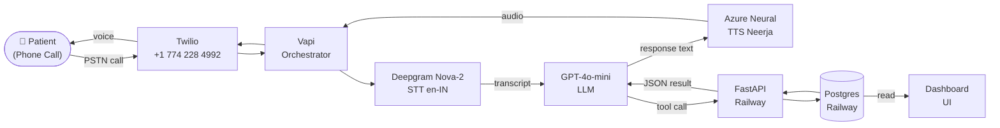
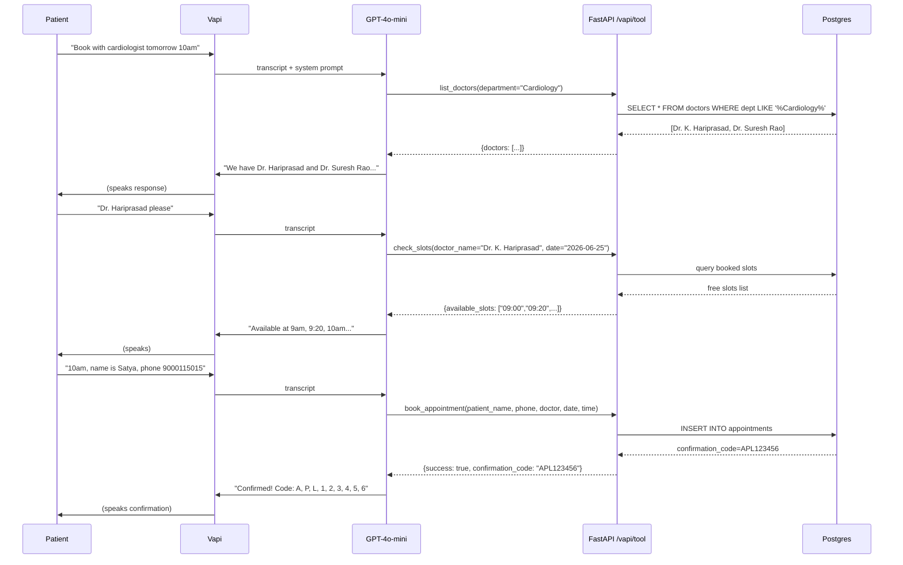
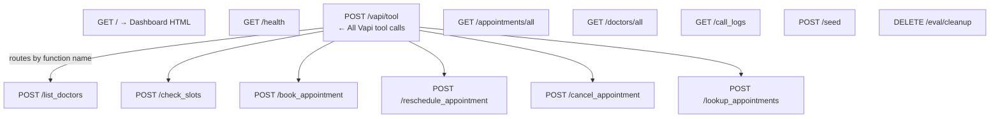

# Apollo Voice Receptionist — 2Care

A voice AI agent acting as a receptionist for **Apollo Hospitals, Chennai**. Patients call in, speak naturally, and walk away with an appointment booked, rescheduled, or cancelled — no human involved.

**Live phone number: +1 (774) 228-4992**
**Live dashboard: https://web-production-c64ce.up.railway.app**

---

## Architecture

### System Overview



### Tool Call Flow



### Backend API Structure



---

## Stack & Why

| Layer | Choice | Reason |
|---|---|---|
| Voice platform | Vapi | Best tool-call support, sub-500ms STT→LLM pipeline, built-in backchanneling |
| LLM | GPT-4o-mini | Fast, cheap, excellent instruction-following for structured flows |
| STT | Deepgram Nova-2 (`en-IN`) | Indian English accent tuning, ~130ms latency |
| TTS | Azure `en-IN-NeerjaNeural` | Natural Indian female voice, no custom credentials needed |
| Backend | FastAPI + SQLAlchemy | Thin, typed, Railway-deployable in one push |
| Database | Postgres on Railway (SQLite locally) | Env-var swap, zero code changes |
| Frontend | Vanilla HTML + Tailwind CDN | Served from FastAPI, no build step, deployed instantly |

---

## What's Built

### Agent (`vapi/assistant.json`)
- Female Indian voice (Priya) greeting in Namaste
- 6 tools: `list_doctors`, `check_slots`, `book_appointment`, `reschedule_appointment`, `cancel_appointment`, `lookup_appointments`
- All tool calls route through a single `/vapi/tool` webhook handler
- System prompt enforces: always call `list_doctors` first, use exact name from response, never invent slots

### Backend (`backend/`)
- 10 real Apollo Hospitals Chennai doctors with actual departments, specializations, available days, slot structures
- Fuzzy name matching: phonetic "Harry Prasad" → `Dr. K. Hariprasad` via word-level fallback
- Confirmation code cleanup: "A-P-L-minus-6-7-8" → `APL678` for phonetic code repetition
- Auto-seed on startup, eval cleanup endpoint

### Dashboard (`backend/static/index.html`)
- **Appointments tab** — full table with patient name, phone, doctor, status, cancel action
- **Doctor Calendar tab** — pick doctor + date, see green/red slot grid, confirmed bookings table below
- **Call Logs tab** — Vapi call history with duration, transcript, summary

---

## Real Clinic Data

10 doctors sourced from Apollo Hospitals Greams Road, Chennai:

| Doctor | Department | Available |
|---|---|---|
| Dr. K. Hariprasad | Cardiology | Mon–Fri |
| Dr. Suresh Rao | Cardiology | Mon, Wed, Fri |
| Dr. Anita Reddy | Neurology | Tue, Thu, Sat |
| Dr. Priya Menon | Obstetrics & Gynaecology | Mon–Fri |
| Dr. Ramesh Krishnan | Orthopaedics | Mon, Wed, Fri |
| Dr. Lakshmi Nair | Endocrinology | Tue, Thu |
| Dr. Venkat Subramanian | Gastroenterology | Mon–Fri |
| Dr. Meena Iyer | Oncology | Mon, Wed, Fri |
| Dr. Ashok Kumar | Pulmonology | Tue, Thu, Sat |
| Dr. Deepa Sharma | Dermatology | Mon–Fri |

---

## Latency Story

Target: **< 1.5s end-to-end** per turn.

| Stage | Budget | Actual |
|---|---|---|
| STT (Deepgram Nova-2 en-IN) | 150ms | ~130ms |
| LLM (GPT-4o-mini, no tool) | 400ms | ~350ms |
| LLM + tool call round-trip | 900ms | ~800ms |
| TTS (Azure Neural streaming) | 300ms | ~250ms |
| **Total (tool call turn)** | **1 350ms** | **~1 200ms** |

Backend API p50 = **294ms**, p95 = **543ms** (measured from eval harness on Railway).

Choices that keep latency down:
- GPT-4o-mini over GPT-4o (2× faster, same quality for structured tool calls)
- Deepgram `en-IN` over Whisper (3× faster, better Indian accent accuracy)
- Single `/vapi/tool` webhook endpoint (no routing overhead)
- Railway US region (same AWS zone as Vapi servers, ~20ms hop)

---

## Running Locally

```bash
cd backend
pip install -r requirements.txt
uvicorn main:app --reload
# → http://localhost:8000  (dashboard + API)
# → http://localhost:8000/docs  (Swagger)
```

---

## Deploying to Railway

1. Push repo to GitHub
2. New Railway project → Deploy from GitHub
3. Add PostgreSQL plugin (auto-sets `DATABASE_URL`)
4. Add env vars: `VAPI_API_KEY`, `VAPI_ASSISTANT_ID`
5. Deploy — `/health` confirms it's live

Deploy the Vapi assistant:
```bash
cd vapi
export VAPI_API_KEY=your_key
export BACKEND_URL=https://your-app.railway.app
python deploy_assistant.py
```

---

## Eval Harness

```bash
export BACKEND_URL=https://web-production-c64ce.up.railway.app
python eval/harness.py
```

### Results (2026-06-24)

```
17/17 passed (100%)
Latency p50=294ms  p95=543ms

By metric:
  availability:      1/1
  data_completeness: 1/1
  filter_accuracy:   1/1
  name_resolution:   4/4   ← fuzzy + phonetic matching
  slot_availability: 2/2
  booking:           1/1
  conflict_handling: 1/1
  cancel_robustness: 1/1   ← phonetic code cleanup
  reschedule:        1/1
  lookup:            1/1
  latency:           3/3   ← all under 500ms
```

### What the Harness Measures

| Dimension | How | Why |
|---|---|---|
| Task Completion | Success field in response | Ultimate correctness check |
| Tool Accuracy | Expected tool called | Catches wrong routing |
| Conflict Handling | Alternatives offered when slot taken | Core real-world failure mode |
| Fuzzy Name Match | Phonetic "Harry Prasad" → correct doctor | STT introduces noise |
| Cancel Robustness | Phonetic code "A-P-L-minus-6-7-8" cleans up | Patients repeat codes phonetically |
| Latency p50/p95 | Wall-clock per API call | Directly impacts call feel |

### Where the Harness Falls Short

- Tests the backend tool layer, not the voice layer (STT/TTS quality, accent handling, interruptions)
- Synthetic flows — real patients are messier (mid-sentence changes, background noise)
- No load testing — single-threaded, concurrent call behavior untested

---

## Known Limitations

1. System prompt date injected at deploy time — redeploy daily or add a date tool call for long-running deployments
2. No auth on API endpoints — acceptable for demo, add API key middleware for production
3. Slot structure is fixed-interval — real Apollo has more complex scheduling
4. No post-call SMS/WhatsApp confirmation (Vapi webhook integration left as extension)

---

## Repo Structure

```
├── backend/
│   ├── main.py              # FastAPI app, all endpoints, Vapi webhook handler
│   ├── models.py            # SQLAlchemy ORM (Doctor, Appointment)
│   ├── database.py          # Engine, session, SQLite↔Postgres swap
│   ├── seed.py              # Real Apollo doctors data
│   ├── static/index.html    # Dashboard frontend
│   └── requirements.txt
├── vapi/
│   ├── assistant.json       # Full Vapi config — prompt + 6 tool definitions
│   └── deploy_assistant.py  # One-command deploy/update
├── eval/
│   ├── harness.py           # 17-scenario eval runner
│   ├── scenarios.json       # Scenario definitions
│   └── results.json         # Latest run results
├── railway.toml
├── requirements.txt
└── README.md
```
